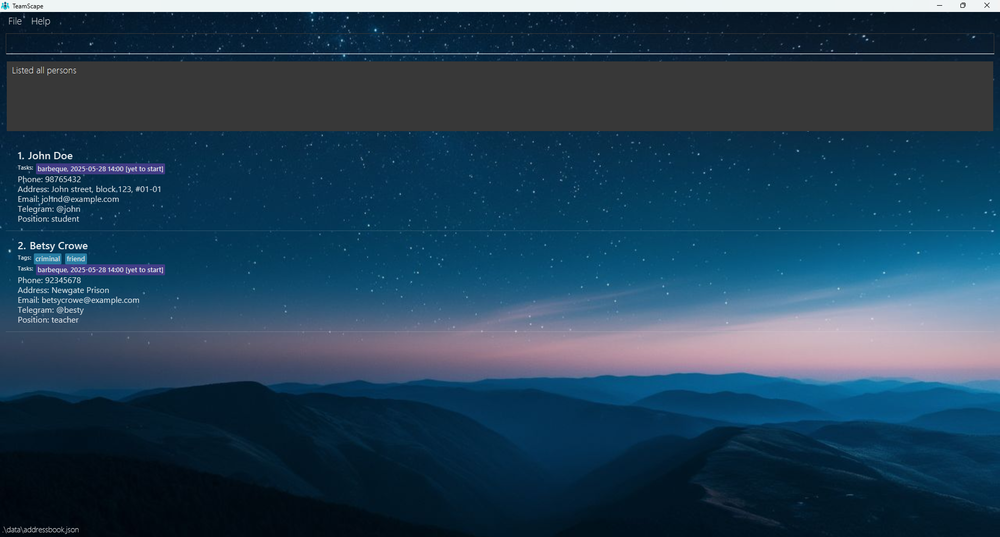
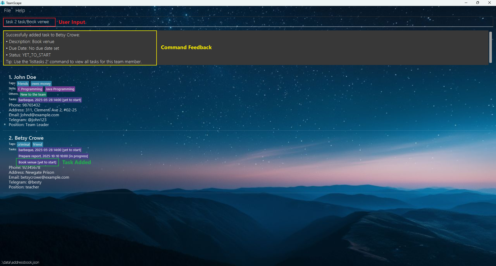
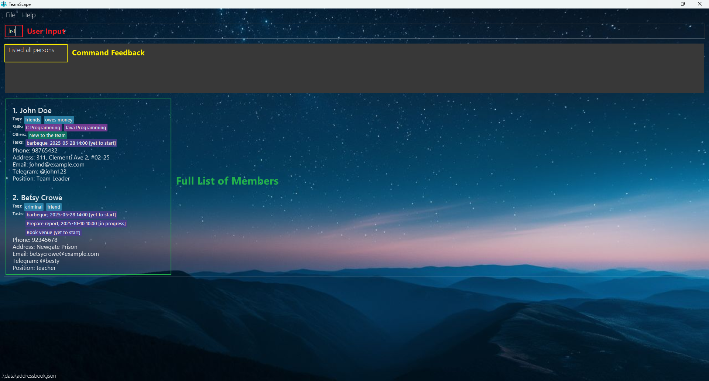
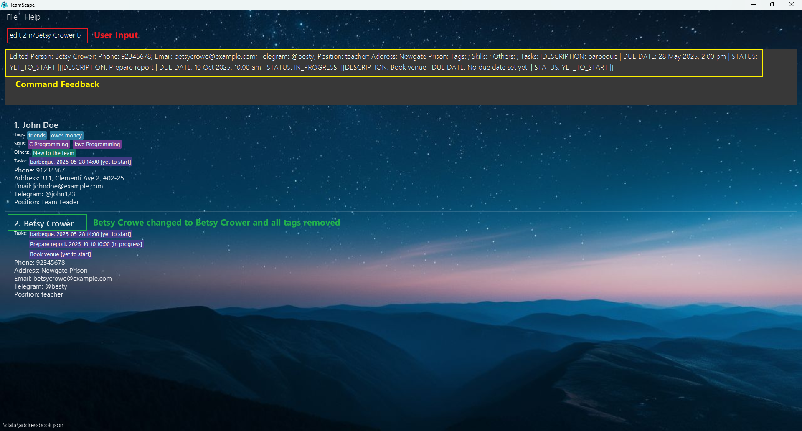
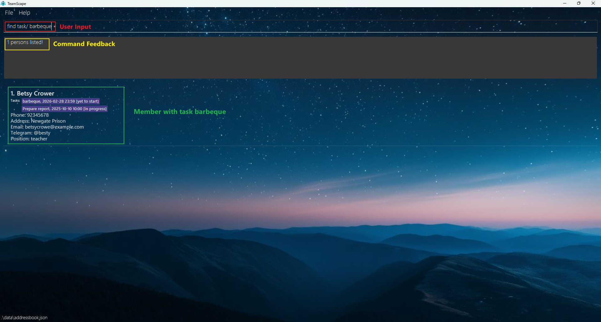
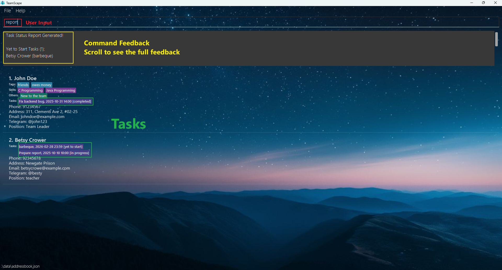

<!--
  layout: default.md
  title: "User Guide"
  pageNav: 3
-->

# TeamScape User Guide

Are you a manager of small teams looking to record tasks remotely? Look no further, presenting to you... TEAMSCAPE

TeamScape is a **desktop app for managing contacts and the tasks under it, optimized for use via a Command Line Interface** (CLI) while still having the benefits of a Graphical User Interface (GUI). If you can type fast and confident to remember command format, TeamScape can get your contact/task management tasks done faster than traditional GUI apps. Adopted from AB3.

### Product scope

**Target user profile**:

* has a need to manage a small team (preferably less than 10)
* need efficient way to track and manage team members' progress and status
* does not require online syncing functionality
* does not require multi-user interactions
* prefers typing to mouse interactions
* is reasonably comfortable using CLI apps

**Value proposition**:

* help users to categorize members by position, grade, skills, and department for easy tracking
* help users to assign tasks, break them into subtasks, and track completion as a percentage
* generate overall statistics for individual members and teams, offering insights into progress and efficiency

<!-- * Table of Contents -->
## Table of Contents
1. [Quick Start](#quick-start)
2. [Features](#features)
    - [Viewing Help](#viewing-help-help)
    - [Adding a Member](#adding-a-member-add)
    - [Adding a Task to a Member](#adding-a-task-to-a-member-task)
    - [Listing All Members](#listing-all-members-list)
    - [Editing a Member](#editing-a-member-edit)
    - [Setting Due Date for a Task](#setting-due-date-for-a-task-setduedate)
    - [Listing Tasks Assigned to a Member](#listing-tasks-assigned-to-a-member-listtasks)
    - [Deleting a Task Under a Member](#deleting-a-task-under-a-member-deltask)
    - [Updating a Task Under a Member](#updating-a-task-under-a-member-updatetask)
    - [Locating Members by Name, Tags, or Tasks](#locating-members-by-name-tags-or-tasks-find)
    - [Generate Task Status Report](#generate-task-status-report-report)
    - [Deleting a Member](#deleting-a-member-delete)
    - [Clearing All Entries](#clearing-all-entries-clear)
    - [Exiting the Program](#exiting-the-program-exit)
    - [Saving the Data](#saving-the-data)
    - [Editing the Data File](#editing-the-data-file)
3. [FAQ](#faq)
4. [Known Issues](#known-issues)
5. [Command Summary](#command-summary)

--------------------------------------------------------------------------------------------------------------------

## Quick start

1. Ensure you have Java `17` or above installed in your Computer. 
   **Mac users:** Ensure you have the precise JDK version prescribed [here](https://se-education.org/guides/tutorials/javaInstallationMac.html).

2. Download the latest `.jar` file from [here](https://github.com/AY2425S2-CS2103-F09-4/tp/releases).

3. Copy the file to the folder you want to use as the _home folder_ for your TeamScape.

4. Open a command terminal, `cd` into the folder you put the jar file in, and use the `java -jar TeamScape.jar` command to run the application. 
   A GUI similar to the below should appear in a few seconds. Note how the app contains some sample data. 
   

5. Type the command in the command box and press Enter to execute it. e.g. typing **`help`** and pressing Enter will open the help window. 
   Some example commands you can try:

   * `list` : Lists all contacts.

   * `add n/John Doe p/98765432 e/johnd@example.com tele/@john pos/student a/John street, block 123, #01-01` : Adds a contact named `John Doe` to the Address Book.

   * `delete 3` : Deletes the 3rd contact shown in the current list.

   * `clear` : Deletes all contacts.

   * `exit` : Exits the app.

6. Refer to the [Features](#features) below for details of each command.

--------------------------------------------------------------------------------------------------------------------

## Features

**Notes about the command format:** 

* All commands word input are case-insensitive

* Words in `UPPER_CASE` are the parameters to be supplied by the user. 
  e.g. in `add n/NAME`, `NAME` is a parameter which can be used as `add n/John Doe`.

* Items in square brackets are optional. 
  e.g `n/NAME [t/TAG]` can be used as `n/John Doe t/friend` or as `n/John Doe`.

* Items with `…`​ after them can be used multiple times including zero times. 
  e.g. `[t/TAG]…​` can be used as ` ` (i.e. 0 times), `t/friend`, `t/friend t/family` etc.

* Parameters can be in any order, unless specified by the particular command. 
  e.g. if the command specifies `n/NAME p/PHONE_NUMBER`, `p/PHONE_NUMBER n/NAME` is also acceptable.

* Extraneous parameters for commands that do not take in parameters (such as `help`, `list`, `exit` and `clear`) will be ignored. 
  e.g. if the command specifies `help 123`, it will be interpreted as `help`.

* If you are using a PDF version of this document, be careful when copying and pasting commands that span multiple lines as space characters surrounding line-breaks may be omitted when copied over to the application.
</box>

* Task Status can only take on one of the following: `yet to start`, `in progress`, `completed`.

* For months with varying numbers of days, if the use enter a date that exceeds the last day of the month (but <= 31), the system will automatically adjust the date to the last valid day of the month. This adjusted date will be displayed in the success message on the GUI. However, if the user enters a day that exceeds the valid range (e.g., a day beyond 31), the date will be considered invalid.

### Viewing help : `help`

Shows a message explaining how to access the help page.

Format: `help`

### Adding a member: `add`

Adds a member to the address book.

Format: `add n/NAME p/PHONE_NUMBER e/EMAIL tele/TELEGRAM pos/POSITION a/ADDRESS [t/TAG]…​ [skill/SKILL]…​ [o/OTHER]…​ [task/TASK]…​`

**Note:**
- Task can have no due date and status (ie task/barbeque or task/barbeque, 2025-05-28 14:00 or task/barbeque, in progress) the default status would be yet to start.
- Repeated names are treated as the same member, regardless of case or other details, and will not be added again.
- A member can have any number of tags, skills, others and tasks (including 0). See "Adding a task to a member" section for more information regarding task creation.
- If multiple tags/skills/others/tasks of the same description is added, it will take the first one of that description.

Examples:
* `add n/John Doe p/98765432 e/johnd@example.com tele/@john pos/student a/John street, block 123, #01-01 task/barbeque, 2025-05-28 14:00, yet to start`
* `add n/Betsy Crowe t/friend e/betsycrowe@example.com tele/@besty pos/teacher a/Newgate Prison p/92345678 t/criminal task/barbeque, 2025-05-28 14:00, yet to start`
  

### Adding a task to a member: `task`

Adds a task to the specified member.

Format: `task MEMBER_INDEX task/TASK_DESCRIPTION[, DUE_DATE][, TASK_STATUS]`

**Note:**
- _`[ ]`_ signifies optional field.
- Task description is mandatory.
- Task Status can be one of: `yet to start`, `in progress`, `completed`.
- Date and task status are optional. If omitted, status defaults to `yet to start`.
- All task details must be separated by commas `,` in the correct order: description, due date _(if any)_,
and then status _(if any)_.
- There can only exist one task with a unique task description.
In other words, another task with the same description cannot be added.
- Multiple `task/` inputs are allowed in the description, but only the first one is treated as the command prefix to add a new task. In other words, everything after the first `task/` is considered part of the description.
- If only one field is provided and it matches a valid task status (e.g. `completed`) or due date format (e.g. `2025-07-12 12:30`)
, it will be interpreted strictly as such. Ensure the correct order of parameters to avoid misinterpretation.

**Limitations:**
- When invalid date format is provided for the task description field, it is accepted as valid as there is no restriction of
  input standardisation.
- When there exists multiple errors with the command input by the user, the error message will only show up one by one at a time.

**Related:**
- See "Setting due date for a task" section for more information on due dates.

Examples:
* `task 2 task/Prepare report, 2025-10-10 10:00, in progress`
* `task 2 task/Book venue`
  

### Listing all members : `list`

Shows a list of all members in the address book.

Format: `list`
    

### Editing a member : `edit`

Edits an existing member in the address book.

Format: `edit INDEX [n/NAME] [p/PHONE_NUMBER] [e/EMAIL] [tele/TELEGRAM] [pos/POSITION] [a/ADDRESS] [t/TAG]…​ [skill/SKILL]…​ [o/OTHER]…​ [task/TASK]…​`

* Edits the member at the specified `INDEX`. The index refers to the index number shown in the displayed member list. The index **must be a positive integer** 1, 2, 3, …​
* At least one of the fields must be provided.
* Existing values will be updated to the input values.
* When editing tags, the existing tags of the member will be removed i.e adding of tags is not cumulative.
* You can remove all the member’s tags by typing `t/` without
    specifying any tags after it. Same for skills, others and tasks.

Examples:
* `edit 1 p/91234567 e/johndoe@example.com` Edits the phone number and email address of the 1st member to be `91234567` and `johndoe@example.com` respectively.
* `edit 2 n/Betsy Crower t/` Edits the name of the 2nd member to be `Betsy Crower` and clears all existing tags.
  

### Setting due date for a task : `setduedate`

Set a due date for a specific task of a member.

Format: `setduedate MEMBER_INDEX taskint/TASK_INDEX due/yyyy-mm-dd hh:mm`
* Set the due date for a task at `TASK_INDEX` of the member at the specified `MEMBER_INDEX`.
* `TASK_INDEX` refers to the index number shown in the task list of a member.
* Both indexes **must be a positive integer** 1, 2, 3, …​
* Due date must be inputted in the format of `yyyy-mm-dd hh:mm`.
* Due date cannot be in the past.
* If due date is already set as such, user will be notified gracefully.
* Special case for some months having different last date: set to the last day of that month if user types in a date more than the valid date of that month (e.g. 29th Feb during a non-leap year -> set to 28th Feb and notify user by printing the set date on the GUI).

Examples:
* `setduedate 2 taskint/1 due/2026-02-29 23:59`

### Listing tasks assigned to a member : `listtasks`

Lists the tasks of
the specified member from the address book.

Format: `listtasks INDEX`

* Lists the member at the specified `INDEX`.
* The index refers to the index number shown in the displayed member list.
* The index **must be a positive integer** 1, 2, 3, …​

Examples:
* `listtasks 2` list the tasks the 2nd person in TeamScape/displayed person list.

Possible Combinations of Commands
* Type `find n/ Betsy` then enter, followed by `listtasks 1` lists the tasks of 1st person in the results of the `find` command.

Example results `listtasks 2`:
* 

Example results of combination of `find n/ Betsy` and `listtasks 1`:
* 

### Deleting a task under a member : `deltask`

Delete a specific task of a member.

Format: `deltask MEMBER_INDEX TASK_INDEX`

* Delete a task at `TASK_INDEX` of the member at the specified `MEMBER_INDEX`.
* `TASK_INDEX` refers to the index number shown in the task list of a member.
* Both indexes **must be a positive integer** 1, 2, 3, …​

Examples:
* `deltask 2 3` deletes the third task of the second member in the displayed member list.
* 

### Updating a task under a member : `updatetask`

Update a specific task of a member.

You may update the description, due date, and/or status.

Format: `updatetask MEMBER_INDEX TASK_INDEX [TASK_DESCRIPTION][, DUE_DATE][, TASK_STATUS]`

**Note:**
- _`[ ]`_ signifies optional field.
- There must be at least one field that is not empty.
- Task parameters must be separated by commas (`,`).
- Task Status can be one of: `yet to start`, `in progress`, `completed`.
- Task order matters, from top to bottom:
    - **Description** _(if any)_
    - **Due Date** *(if any)* – Format: `yyyy-MM-dd HH:mm`
    - **Status** *(if any)* – One of: `yet to start`, `in progress`, `completed` (case-insensitive)

**Limitations:**
- When invalid date format is provided for the task description field, it is accepted as valid as there is no restriction of
input standardisation.
- When there exists multiple errors with the command input by the user, the error message will only show up one by one at a time.

**Examples: (all possible combinations)**
- `updatetask 1 1 Fix backend bug`
  Updates only the task description.
- `updatetask 1 2 Fix backend bug, 2025-10-31 14:00`
  Updates the task description and due date.
- `updatetask 1 1 2025-12-12 23:59, completed`
  Updates the due date and status.
- `updatetask 1 1 completed`
  Updates only the task status.
- `updatetask 1 2 Fix backend bug, 2025-10-31 14:00, completed`
  Updates all three fields.

### Locating members by name, tags, or tasks: `find`

Finding members by name:

Format: `find n/ KEYWORD [MORE_KEYWORDS]`

Finds members whose names contain any of the given keywords.

* The order of the keywords does not matter. e.g. `Hans Bo` will match `Bo Hans`
* Only the name is searched.
* Only full words will be matched e.g. `Han` will not match `Hans`
* Members matching at least one keyword will be returned (i.e. `OR` search).
  e.g. `Hans Bo` will return `Hans Gruber`, `Bo Yang`

Examples:
* `find n/ john` returns `John Doe`
* `find n/ john betsy` returns `John Doe`, `Betsy Crower` 
  

Finding members by tags:

Format: `find t/ KEYWORD [MORE_KEYWORDS]`

Finds members whose tags contain any of the given keywords.

Example Usage:
* `find t/ friends money` returns all Members tagged with friends or money
  

Finding members by tasks:

Format: `find task/ KEYWORD [MORE_KEYWORDS]`

Finds members whose task description contain any of the given keywords.

Example Usage:
* `find task/ barbeque` returns all members with task descriptions containing the word 'bbq'.
  

Usage Notes:
Format: `find PREFIX/KEYWORD`

This finds all members who meet the condition specified by the single prefix and keyword. Only one prefix (`n/`, `t/`, or `task/`) can be used at a time, and the keyword cannot be blank.

**Important Notes:**
- You cannot use multiple prefixes in the same command.
- You cannot repeat the same prefix multiple times.
- The keyword must not be empty.

**Correct Examples:**
- `find n/John` finds all members whose names contain "John".
- `find t/friends` finds all members tagged as "friends".
- `find task/barbeque` finds all members with task descriptions containing "barbeque".

**Incorrect Examples:**
- `find n/John t/friends` (Error: Multiple prefixes used.)
- `find n/John n/Doe` (Error: Repeated prefix.)
- `find n/` (Error: Keyword is blank.)
- `find task/` (Error: Keyword is blank.)
- `find` (Error: No prefix or keyword provided.)

### Generate Task Status Report : `report`

Shows a summary of all tasks and their completion statuses.

* Users are associated with their tasks under their status
* The report is divided into three sections: ‘Yet to Start’, ‘In Progress’, and ‘Completed’
* The number in parentheses next to each task status represents how many member have tasks in that status.
* Under each task status, the names of the member are listed, followed by their assigned tasks in parentheses
* If a member has multiple tasks, they are displayed in the order the tasks were added
* For example, if Bryan first received the task 'Sleep' and later received the task 'Swim', the report will show:
Bryan (Sleep, Swim), indicating that 'Sleep' was assigned first, followed by 'Swim'

Format: `report`

Example output:

### Deleting a member : `delete`

Deletes the specified member from the address book.

Format: `delete INDEX`

* Deletes the member at the specified `INDEX`.
* The index refers to the index number shown in the displayed member list.
* The index **must be a positive integer** 1, 2, 3, …​

Examples:
* `delete 2` deletes the 2nd member in TeamScape.
    

### Clearing all entries : `clear`

Clears all entries from the address book.

Format: `clear`

### Exiting the program : `exit`

Exits the program.

Format: `exit`

### Saving the data

TeamScape data are saved in the hard disk automatically after any command that changes the data. There is no need to save manually.

### Editing the data file

TeamScape data are saved automatically as a JSON file `[JAR file location]/data/addressbook.json`. Advanced users are welcome to update data directly by editing that data file.

**Caution:**
If your changes to the data file makes its format invalid, TeamScape will discard all data and start with an empty data file at the next run.  Hence, it is recommended to take a backup of the file before editing it. 
Furthermore, certain edits can cause the TeamScape to behave in unexpected ways (e.g., if a value entered is outside the acceptable range). Therefore, edit the data file only if you are confident that you can update it correctly.

--------------------------------------------------------------------------------------------------------------------

## FAQ

**Q**: How do I transfer my data to another Computer? 
**A**: Install the app in the other computer and overwrite the empty data file it creates with the file that contains the data of your previous TeamScape home folder.

--------------------------------------------------------------------------------------------------------------------

## Known issues

1. **When using multiple screens**, if you move the application to a secondary screen, and later switch to using only the primary screen, the GUI will open off-screen. The remedy is to delete the `preferences.json` file created by the application before running the application again.
2. **If you minimize the Help Window** and then run the `help` command (or use the `Help` menu, or the keyboard shortcut `F1`) again, the original Help Window will remain minimized, and no new Help Window will appear. The remedy is to manually restore the minimized Help Window.

--------------------------------------------------------------------------------------------------------------------

## Command Summary

| Action           | Format, Examples                                                                                                                                                                                                                                                     |
|------------------|----------------------------------------------------------------------------------------------------------------------------------------------------------------------------------------------------------------------------------------------------------------------|
| **Add**          | `add n/NAME p/PHONE_NUMBER e/EMAIL tele/TELEGRAM pos/POSITION a/ADDRESS [t/TAG]…​ [s/SKILL]…​ [o/OTHER]…​ [task/TASK]…​`  e.g., `add n/John Doe p/98765432 e/johnd@example.com tele/@john pos/student a/John street task/barbeque, 2025-05-28 14:00, yet to start` |
| **Clear**        | `clear`                                                                                                                                                                                                                                                              |
| **Delete**       | `delete INDEX`  e.g., `delete 3`                                                                                                                                                                                                                                  |
| **Edit**         | `edit INDEX n/NAME p/PHONE_NUMBER e/EMAIL tele/TELEGRAM pos/POSITION a/ADDRESS [t/TAG]…​ [s/SKILL]…​ [o/OTHER]…​ [task/TASK]…​`  e.g., `edit 2 n/Betsy Crower t/`                                                                                                 |
| **Find (Name)**  | `find n/ KEYWORD [MORE_KEYWORDS]`  e.g., `find n/ alex david`                                                                                                                                                                                                     |
| **Find (Tag)**   | `find t/ KEYWORD [MORE_KEYWORDS]`  e.g., `find t/ colleagues friends`                                                                                                                                                                                             |
| **Find (Task)**   | `find task/ KEYWORD [MORE_KEYWORDS]`  e.g., `find task/ presentation`                                                                                                                                                                                             |
| **Add Task**     | `task MEMBER_INDEX task/TASK_DESCRIPTION[, DUE_DATE, TASK_STATUS]`   e.g., `task 3 task/Book venue`                                                                                                                                                               |
| **Delete task**  | `deltask MEMBER_INDEX TASK_INDEX`  e.g., `deltask 3 2`                                                                                                                                                                                                            |
| **Update Task**  | `updatetask MEMBER_INDEX TASK_INDEX [TASK_DESCRIPTION][, DUE_DATE][, TASK_STATUS]`  e.g., `updatetask 1 1 2025-12-31 23:59, completed`                                                                                                                            |
| **List**         | `list`                                                                                                                                                                                                                                                               |
| **List Tasks**   | `listtasks INDEX`  e.g., `listtasks 2`                                                                                                                                                                                                                            |
| **Set Due Date** | `setduedate MEMBER_INDEX taskint/TASK_INDEX due/yyyy-mm-dd hh:mm`  e.g., `setduedate 2 taskint/1 due/2025-10-10 23:59`                                                                                                                                            |
| **Report**       | `report`                                                                                                                                                                                                                                                             |
| **Help**         | `help`                                                                                                                                                                                                                                                               |
| **Exit**         | `exit`                                                                                                                                                                                                                                                               |
